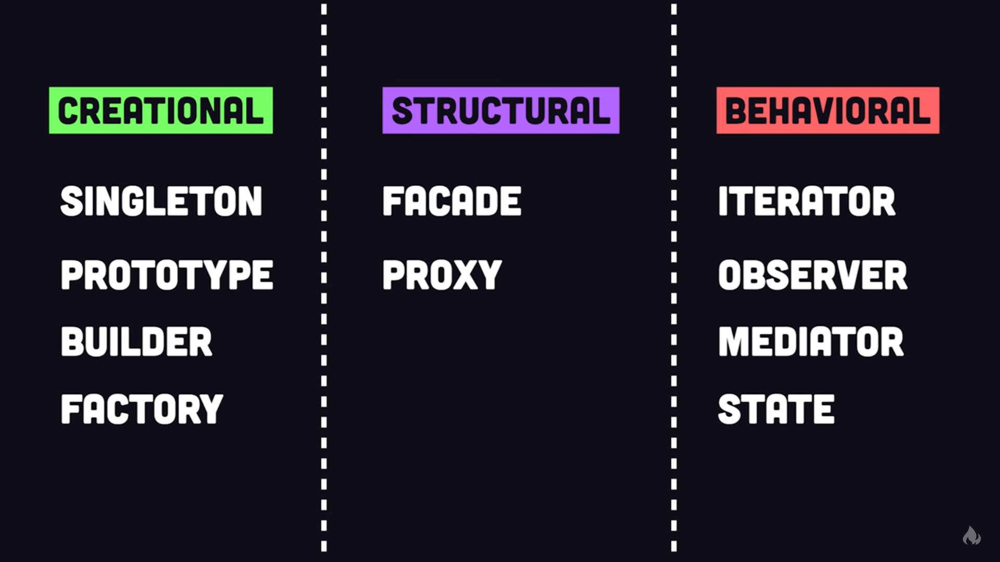

# Design Patterns
This repository holds mostly used software design patterns that can be
implemented to any programming language that meet the basic requirements.

# Classifications

# Explaination Video Reference
[10 Design Patterns Explained in 10 Minutes](https://youtu.be/tv-_1er1mWI)
